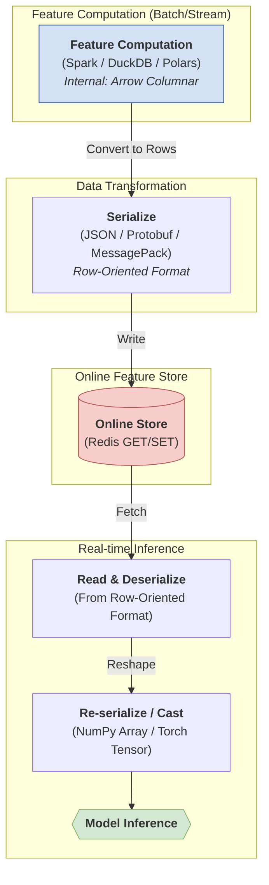
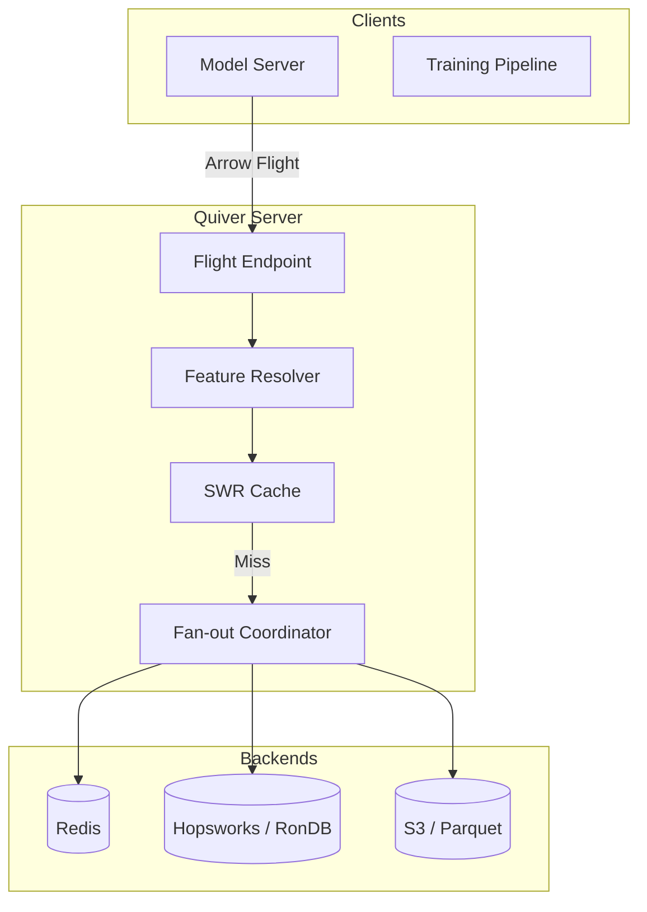

# Quiver

Quiver is an __experimental__ in-flight grpc server for serving features across different backends. 
It holds Arrow-formatted feature data and serves it to model servers on demand. Think of it as **Triton for feature serving**.

---

## Why?

Feature stores are good at registering, versioning and computing features. 
An area that has not received as much attention is the path from computed feature to model input.
Today, the serving path for a lot of inference workloads looks something like this:



From the diagram above, several bottlenecks become apparent:
- **Redundant SerDe**: Serialization happens on every request, costing CPU cycles and increasing latency.
- **Impedance Mismatch**: Row-oriented formats (JSON/Protobuf) are fundamentally at odds with the columnar nature of modern data processing and ML.
- **Fan-Out logic in Model Servers**: Application code becomes bloated with infrastructure glue for querying multiple backends.

Quiver aims to optimize the inference path from computation to model input by:

- **Zero-Copy Memory Mapping**: For Arrow-native backends (Parquet, Delta Lake, Snowflake), data maintains its columnar memory layout from disk to model memory. No CPU-bound serialization ever occurs.
- **Transcoding Cache**: For legacy row-oriented backends (Redis/RonDB), Quiver keeps data as Arrow buffers in memory on the first cache miss. Subsequent "warm" hits are served as zero-copy Arrow buffers, bypassing the slow database path.
- **Kernel-Level Alignment**: By serving Arrow directly, Quiver aligns perfectly with the internal memory representation of NumPy, PyTorch, and JAX, enabling O(1) transfer to model tensors.
- **Observability without Instrumentation**: A monitoring interceptor observes the Arrow stream directly to track drift, null rates, and latency without modifying feature definitions.

---

## The Vision

While NVIDIA Triton optimizes the compute-bound execution of models on GPUs, Quiver optimizes the I/O-bound orchestration of the data that feeds them.

In a traditional stack, model servers are burdened with the overhead of feature orchestration—querying disparate databases, parsing row-oriented data, and manually aligning entity keys into tensors. Quiver offloads this data preparation phase into a dedicated, Rust-based infrastructure layer.

---


## Architecture



## Current Status: v0.1 Alpha

Quiver is in early development. The core Arrow flight server is complete. The server is implemented in Rust for high performance and zero-copy serving.

### What's Possible Now
- **Arrow Flight Protocol**: Implements the standard `FlightService` for unified data transport.
- **Unified Resolver**: Decouples model servers from backend specifics.
- **Memory Adapter**: High-performance in-memory backend for testing and fast lookups.
- **Static Registry**: Centralized management of feature schemas and backend routing.
- **gRPC Health Check**: Native support for standard health probes (`grpc.health.v1.Health`).
- **gRPC Reflection**: Integrated service discovery for tools like `grpcurl`.
---

## Getting Started

### Prerequisites
- [Rust](https://www.rust-lang.org/tools/install)
- [Protobuf Compiler](https://grpc.io/docs/protoc-installation/) (`brew install protobuf` on Mac)
- [grpcurl](https://github.com/fullstorydev/grpcurl) (for manual testing)

### Quick Start

1. **Clone and build**:
   ```bash
   git clone <repository-url>
   cd quiver
   make  # Runs quality checks and tests
   ```

2. **Create configuration** (see [Configuration](#configuration) section below)

3. **Start the server**:
   ```bash
   make run
   # Or use cargo directly:
   # cd quiver-core && cargo run
   ```

4. **Verify it's working**:
   ```bash
   # Check server health
   grpcurl -plaintext localhost:8815 grpc.health.v1.Health/Check
   
   # List available services
   grpcurl -plaintext localhost:8815 list
   ```

### Configuration

Quiver uses a layered configuration system. Settings are resolved in the following order of precedence:

1.  **Environment Variables**: Prefixed with `QUIVER__` (e.g., `QUIVER__SERVER__PORT=9001`).
2.  **Config File**: A mandatory `config.yaml` file in the working directory.
3.  **Defaults**: Internal fallbacks (Host: `0.0.0.0`, Port: `8815`).

> [!IMPORTANT]
> The server will fail to start if the `config.yaml` file is missing, or if either the `registry.views` or `adapters` sections are empty.

### Example `config.yaml`

```yaml
server:
  host: "127.0.0.1"
  port: 8815

registry:
  type: static
  views:
    - name: "user_features"
      entity_type: "user"
      entity_key: "user_id"
      columns:
        - name: "entity_id"
          arrow_type: "string"
          nullable: false
          source: "memory"
        - name: "score"
          arrow_type: "float64"
          nullable: true
          source: "memory"

adapters:
  memory:
    type: memory
```

Once the config file is ready, start the server:

```bash
make run
```

The server starts on `127.0.0.1:8815` and should display:
```
INFO Quiver server starting on 127.0.0.1:8815
INFO Loaded 1 feature view: user_features
INFO Server ready for connections
```

---


## Exploring the API

### List Services
You can discover all available services:
```bash
grpcurl -plaintext localhost:8815 list
```

### Fetch a Schema
Retrieve the Arrow schema for the `user_features` view:
```bash
grpcurl -plaintext -d '{"path": ["user_features"]}' \
  localhost:8815 arrow.flight.protocol.FlightService/GetSchema
```

### Check Health
```bash
grpcurl -plaintext localhost:8815 grpc.health.v1.Health/Check
```

---

## Python Client

Quiver includes a high-performance Python client with zero-copy Arrow integration, ML framework exports (pandas, PyTorch, TensorFlow, Polars), and comprehensive error handling.

**[📖 See Python Client Documentation](quiver-python/README.md)**

Quick example:
```python
import quiver

client = quiver.Client("localhost:8815")
features = client.get_features(
    feature_view="user_features",
    entities=["user_123", "user_456"],
    features=["entity_id", "score"]
)
df = features.to_pandas()
client.close()
```

---

## Development

### Build System

Quiver uses `make` for all development tasks:

```bash
# Main workflow - format, lint, and test everything
make

# Individual tasks
make build          # Build Rust components
make test-rs        # Run Rust tests only
make pytest         # Run Python tests only
make quality        # Format and lint all code
make run            # Start the development server
```

### Project Structure

```
quiver/
├── quiver-core/         # Rust server implementation
├── quiver-python/       # Python client library
├── proto/v1/           # Protocol buffer definitions
├── conf.yaml           # Example configuration
└── Makefile           # Build automation
```

### Testing

The project includes comprehensive test coverage:
- **Unit tests**: Core logic and adapter functionality
- **Integration tests**: End-to-end server behavior
- **Python client tests**: Client library functionality

Run all tests with:
```bash
make test
```

---

## Roadmap

- v0.1 Alpha: Core Rust server, DuckDB/Redis adapters, basic hot cache. (Current)
- v0.2 Beta: Multi-backend fan-out, SWR cache manager, Feast registry integration.
- v0.3: Kafka Streams adapter, bidirectional do_exchange for high-frequency serving.
- v1.0: Production HA deployment, multi-tenancy, and performance benchmarks.
